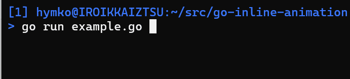

go-inline-animation
===================



[example.go](./example.go)

```example.go
package main

import (
    "fmt"
    "time"

    "github.com/mattn/go-colorable"

    "github.com/nyaosorg/go-inline-animation"
)

func main() {
    term := colorable.NewColorableStdout()
    fmt.Fprint(term, animation.CursorOff)
    defer fmt.Fprintln(term, animation.CursorOn)

    end := animation.Dots.Progress(term)
    defer end()

    // You can write a time-consuming process instead of Sleep.
    time.Sleep(time.Second * 10)
}
```

[example2.go](./example2.go)

```example2.go
package main

import (
    "fmt"
    "time"

    "github.com/mattn/go-colorable"

    "github.com/nyaosorg/go-inline-animation"
)

func main() {
    term := colorable.NewColorableStdout()
    fmt.Fprint(term, animation.CursorOff)
    defer fmt.Fprintln(term, animation.CursorOn)

    end := animation.Animation{
        Frame:    []string{"(^_^)", "(-_-)"},
        Interval: time.Second / 2,
    }.Progress(term)

    defer end()

    // You can write a time-consuming process instead of Sleep.
    time.Sleep(time.Second * 10)
}
```
